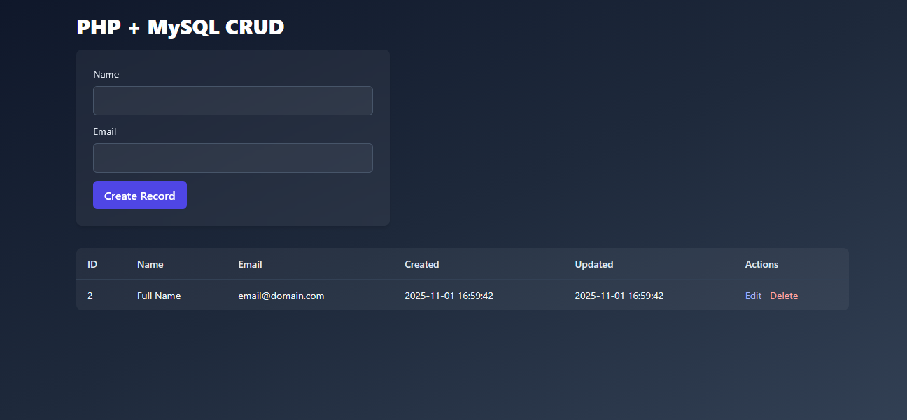

<div style="display: flex; align-items: center; gap: 10px;">
  
  
    
</div>

## LAMP STACK CRUD Application using Docker

A containerized LAMP (Linux, Apache, MySQL, PHP) application deployed using Docker Compose.


## Features

- **LAMP Stack** (Apache, MySQL, PHP) for a CRUD web app  
- Fully containerized and network-isolated  
- Easy to extend or deploy on any Docker host  

---
## Execution Steps

1. Clone the repository:

   ```bash
   git clone https://github.com/mirakib/DevOps-Projects.git
   cd DevOps-Projects/Docker/CRUD/LAMP
   ```

2. Build and start the containers:

   ```bash
   docker-compose up -d
   ```

3. Stop the containers when done:

   ```bash
   docker-compose down
   ```

## Output




#### A Extended version of this project can be found here:

- [Dockerized LAMP Stack with Prometheus & Grafana Monitoring](https://github.com/mirakib/dockerize-lamp-monitoring-stack)
