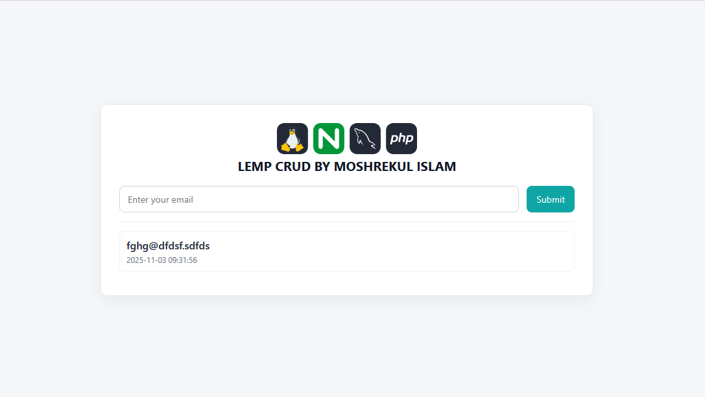

<div style="display: flex; align-items: center; gap: 10px;">
  
</div>

## LEMP STACK CRUD Application using Docker

A containerized LEMP (Linux, Nginx, MySQL, PHP) application deployed using Docker Compose.


## Features

- **LEMP Stack** (Nginx, MySQL, PHP) for a CRUD web app  
- Fully containerized and network-isolated  
- Easy to extend or deploy on any Docker host  

---
## Execution Steps

1. Clone the repository:

   ```bash
   git clone https://github.com/mirakib/DevOps-Projects.git
   cd DevOps-Projects/Docker/CRUD/LEMP
   ```

2. Build and start the containers:

   ```bash
   docker-compose up -d
   ```

3. Stop the containers when done:

   ```bash
   docker-compose down
   ```

## Output


