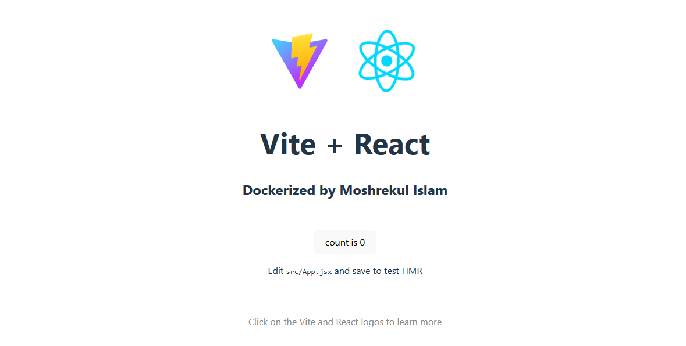

# React Single Page Application (SPA) with Vite, Nginx & Docker

[](https://skillicons.dev)

## 📝 Description
This project demonstrates how to build and serve a **React Single Page Application (SPA)** using **Vite** for lightning-fast development and **Nginx** as the production-grade static file server — all fully containerized with a **multi-stage Docker build**.

The setup is lightweight, optimized for production, and ensures clean separation between the build and serve stages.


## 🎯 Goal
To create a modern, containerized frontend stack that:
- Uses **Vite** for blazing-fast builds and hot-reload during development.
- Uses **Nginx** for efficient production serving.
- Utilizes **Docker multi-stage builds** for smaller image sizes.


## 🧰 Technologies Used

| Technology | Version | Purpose |
|-------------|----------|----------|
| **React** | 19.x | UI library for building React SPA |
| **Vite** | 5.x+ | Frontend build tool (faster alternative to CRA) |
| **Node.js** | 22.x | Used for building the React app |
| **npm** | 10.x | Package manager for Node modules |
| **Nginx** | stable-alpine | Production web server for static assets |
| **Docker** | 28.x+ | Containerization platform |

---

## 🏗️ Project Setup Steps

### 1️⃣ Initialize the React + Vite Project
Run the following commands to scaffold the project:
```bash
npm create vite@latest my-react-spa
cd my-react-spa
npm install
npm run dev
```

### 2️⃣ Create the Dockerfile

Create a `Dockerfile` in the project root with the following content:

```
# ---------- STAGE 1: build the React app ----------
FROM node:20-alpine AS builder

WORKDIR /app

# Install build dependencies
# Copy only package manifests first (cache npm install)
COPY package.json package-lock.json* ./

RUN npm ci --silent

# Copy rest of the source
COPY . .

# Build the app (production)
ENV NODE_ENV=production
RUN npm run build

# ---------- STAGE 2: serve with nginx ----------
FROM nginx:stable-alpine

# Remove default nginx static files (optional but ensures clean)
RUN rm -rf /usr/share/nginx/html/*

# Copy our nginx config (overrides default)
COPY nginx.conf /etc/nginx/conf.d/default.conf

# Copy built static assets from the builder stage
COPY --from=builder /app/dist /usr/share/nginx/html

# Expose port 80
EXPOSE 80

# Use the default nginx start command
CMD ["nginx", "-g", "daemon off;"]

```

### 3️⃣ Create the Nginx Configuration
Create a file named `nginx.conf` in the project root with the following content:

```
server {
    listen 80;
    server_name _;

    root /usr/share/nginx/html;
    index index.html;

    # Serve static files directly, fall back to index.html for SPA routes
    location / {
        try_files $uri $uri/ /index.html;
    }

    # Optional: gzip static assets for smaller transfers (production benefit)
    gzip on;
    gzip_types text/plain text/css application/json application/javascript text/xml application/xml application/xml+rss text/javascript;
}

```

### 4️⃣ Build and Run the Docker Container

Build the Docker image:
```bash
docker build -t my-react-spa .
``` 
Run the container:
```bash
docker run -d -p 8080:80 --name my-react-spa my-react-spa
``` 

### 5️⃣ Access the Application
Open your browser and navigate to `http://localhost:8080` to see your React SPA served by Nginx!

## 📸 Screenshot


